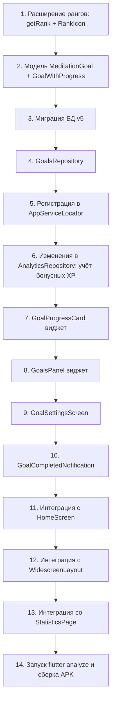

# План: Цели и прогресс (Goals & Progress)

STATUS: ✅ Реализовано (цели, XP-бонусы, 11 рангов — коммит 60c85c6).

## 1. Обзор функционала

Пользователь сможет устанавливать персональные цели по медитации и отслеживать прогресс их выполнения. **За выполнение целей начисляются бонусные XP**, что даёт дополнительную мотивацию и ускоряет повышение уровня.

**Дополнительно**: расширяем систему рангов с 4 до **11 уровней**, чтобы у пользователей была более глубокая и частая прогрессия, мотивирующая продолжать практику.

---

## 2. Расширение системы рангов

### 2.1. Текущая система

| Уровни | Ранг | Эмодзи |
|--------|------|--------|
| 0 | Новичок осознанности | 🌱 |
| 1–2 | Искатель спокойствия | 🌿 |
| 3–5 | Хранитель тишины | 🪷 |
| 6+ | Мастер баланса | 🌸 |

### 2.2. Новая система (11 рангов)

| Уровни | Ранг | Эмодзи | Примерное время достижения* |
|--------|------|--------|---------------------------|
| 0 | Новичок осознанности | 🌱 | 0 мин |
| 1–2 | Искатель спокойствия | 🌿 | 10–40 мин |
| 3–5 | Хранитель тишины | 🪷 | 90–250 мин |
| 6–8 | Мастер баланса | 🌸 | 360–640 мин |
| 9–11 | Странник глубин | 🕊️ | 810–1210 мин |
| 12–14 | Пробуждённый | ☀️ | 1440–1960 мин |
| 15–18 | Мудрец | 🏔️ | 2250–3240 мин |
| 19–23 | Просветлённый | ✨ | 3610–5290 мин |
| 24–29 | Легенда | 🔥 | 5760–8410 мин |
| 30–37 | Бессмертный | ⚡ | 9000–13690 мин |
| 38+ | Божественный | 👑 | 14440+ мин |

*\*Расчёт по формуле: уровень = floor(sqrt((minutes * 10) / 100))*

### 2.3. Изменяемые файлы

| Файл | Изменения |
|------|-----------|
| [`lib/domain/progress_calculator.dart`](lib/domain/progress_calculator.dart) | Расширить `getRank` с 4 до 11 рангов |
| [`lib/core/widgets/zen_ui.dart`](lib/core/widgets/zen_ui.dart) | Расширить `RankIcon._emojiForLevel` с 4 до 11 эмодзи |

---

## 3. Система XP-бонусов за цели

### 3.1. Как это работает

Текущая система XP (см. [`ProgressCalculator.calculateLevel`](lib/domain/progress_calculator.dart:15)):
- Уровень = `floor(sqrt((minutes * 10) / 100))`
- XP = минуты медитации (1 минута = 1 XP)
- Для перехода с уровня N на N+1 нужно: `((N+1)² × 100) / 10` минут

**Бонусные XP** — это виртуальные баллы, которые НЕ сохраняются как минуты медитации, а добавляются поверх при расчёте уровня. То есть:

```
Эффективные минуты = реальные минуты + бонусные XP за цели
Уровень = floor(sqrt((эффективные_минуты * 10) / 100))
```

### 3.2. Когда начисляются бонусы

| Событие | Что происходит |
|---------|---------------|
| Цель выполнена впервые за период | Начисляется XP, флаг `rewarded = true` |
| Цель остаётся выполненной | XP уже начислены, повторно не начисляются |
| Цель перестала быть выполненной | Флаг `rewarded` сбрасывается, XP вычитаются |
| Новая сессия завершена | Пересчёт всех целей и бонусов |

### 3.3. Хранение бонусов

В таблице `goals` добавить поля:

```sql
CREATE TABLE IF NOT EXISTS goals (
  id TEXT PRIMARY KEY,
  type TEXT NOT NULL,
  target_value REAL NOT NULL,
  bonus_xp INTEGER NOT NULL DEFAULT 0,  -- сколько XP даёт эта цель
  rewarded INTEGER NOT NULL DEFAULT 0,   -- 1 если XP уже начислены за текущий период
  created_at TEXT NOT NULL,
  updated_at TEXT NOT NULL
);
```

- `rewarded` сбрасывается в 0 при начале нового периода (для daily — каждый день, для weekly — каждый понедельник)
- При пересчёте прогресса: если `isCompleted && !rewarded` → начислить XP, если `!isCompleted && rewarded` → отозвать XP

### 3.4. Влияние на уровень

В [`AnalyticsRepository.getXpProgress`](lib/data/analytics_repository.dart:283) и [`getUserProgression`](lib/data/analytics_repository.dart:139):

```dart
// Текущая формула:
final minutes = await getTotalMinutes();

// Новая формула:
final realMinutes = await getTotalMinutes();
final bonusXp = await _goalsRepository.getTotalBonusXp();
final effectiveMinutes = realMinutes + bonusXp;
final level = ProgressCalculator.calculateLevel(effectiveMinutes);
```

### 3.5. UI-индикация бонусов

- В XP-баре показывать: `Осталось N мин до следующего уровня (включая M бонусных XP за цели)`
- При выполнении цели — всплывающее уведомление: `🎯 Цель выполнена! +50 XP`
- В карточке цели показывать: `+50 XP при выполнении`

---

## 4. Типы целей

| Тип | Описание | Пример | XP за выполнение |
|-----|----------|--------|------------------|
| `daily_minutes` | Минут медитации в день | 10 мин/день | +50 XP |
| `weekly_sessions` | Количество сессий в неделю | 5 сессий/неделя | +100 XP |
| `weekly_minutes` | Минут медитации в неделю | 60 мин/неделя | +150 XP |
| `streak_days` | Цель по непрерывной серии дней | 7 дней подряд | +200 XP |

### Логика расчёта прогресса

- **daily_minutes**: сравнивается сумма минут за сегодня с целевым значением. Прогресс = min(факт / цель, 1.0). Сбрасывается каждый день.
- **weekly_sessions**: сравнивается количество сессий за текущую неделю (пн–вс) с целью. Прогресс = min(факт / цель, 1.0). Сбрасывается каждую неделю.
- **weekly_minutes**: аналогично weekly_sessions, но по минутам.
- **streak_days**: сравнивается текущий streak (из ProgressCalculator.calculateStreak) с целевым значением. Прогресс = min(текущий_стрик / цель, 1.0). Не сбрасывается — растёт вместе со стриком.

---

## 5. Изменения в слое данных

### 5.1. Новая таблица в SQLite — `goals`

Файл: [`lib/data/database_provider.dart`](lib/data/database_provider.dart)

Добавить миграцию v5:

```sql
CREATE TABLE IF NOT EXISTS goals (
  id TEXT PRIMARY KEY,
  type TEXT NOT NULL,          -- 'daily_minutes' | 'weekly_sessions' | 'weekly_minutes' | 'streak_days'
  target_value REAL NOT NULL,  -- целевое значение (например 10.0 для 10 минут)
  bonus_xp INTEGER NOT NULL DEFAULT 50,  -- XP за выполнение
  rewarded INTEGER NOT NULL DEFAULT 0,   -- флаг: начислены ли XP за текущий период
  created_at TEXT NOT NULL,    -- ISO 8601
  updated_at TEXT NOT NULL     -- ISO 8601
);
```

Новые методы в `DatabaseProvider`:

| Метод | Сигнатура | Описание |
|-------|-----------|----------|
| `getGoals` | `Future<List<Map<String, dynamic>>>` | Получить все цели |
| `saveGoal` | `Future<void>(String id, String type, double targetValue, {int bonusXp})` | Сохранить/обновить цель (UPSERT) |
| `deleteGoal` | `Future<void>(String id)` | Удалить цель |
| `getGoalById` | `Future<Map<String, dynamic>?>(String id)` | Получить одну цель |
| `updateGoalRewarded` | `Future<void>(String id, bool rewarded)` | Обновить флаг rewarded |
| `resetDailyRewards` | `Future<void>()` | Сбросить rewarded для daily целей |
| `resetWeeklyRewards` | `Future<void>()` | Сбросить rewarded для weekly целей |
| `getTotalBonusXp` | `Future<int>()` | Сумма bonus_xp всех целей с rewarded=1 |

### 5.2. Новая модель — `MeditationGoal`

Файл: [`lib/data/meditation_goal.dart`](lib/data/meditation_goal.dart) (новый)

```dart
enum GoalType { dailyMinutes, weeklySessions, weeklyMinutes, streakDays }

class MeditationGoal {
  final String id;
  final GoalType type;
  final double targetValue;
  final int bonusXp;         // XP за выполнение
  final bool rewarded;       // начислены ли XP за текущий период
  final DateTime createdAt;
  final DateTime updatedAt;

  // fromMap, toMap, copyWith
}

class GoalWithProgress {
  final MeditationGoal goal;
  final double progress;     // 0.0 .. 1.0
  final double currentValue; // сколько уже накоплено
  final bool isCompleted;    // progress >= 1.0
}
```

### 5.3. Новый репозиторий — `GoalsRepository`

Файл: [`lib/data/goals_repository.dart`](lib/data/goals_repository.dart) (новый)

```dart
class GoalsRepository {
  final DatabaseProvider _db;

  GoalsRepository(this._db);

  Future<List<MeditationGoal>> getGoals();
  Future<void> setGoal(GoalType type, double targetValue, {int bonusXp});
  Future<void> removeGoal(String id);

  /// Рассчитать прогресс по всем целям и обновить флаги rewarded.
  /// Возвращает список целей с прогрессом.
  Future<List<GoalWithProgress>> calculateAndUpdateProgress({
    required int todayMinutes,
    required int weeklySessions,
    required int weeklyMinutes,
    required int currentStreak,
  });

  /// Сумма XP всех целей с rewarded=1.
  Future<int> getTotalBonusXp();

  /// Сбросить rewarded для целей, у которых начался новый период.
  Future<void> resetExpiredRewards();
}
```

### 5.4. Регистрация в `AppServiceLocator`

Файл: [`lib/services/app_service_locator.dart`](lib/services/app_service_locator.dart)

Добавить поле `GoalsRepository? _goalsRepo` и геттер `goalsRepo`. Инициализировать после `_db`.

### 5.5. Изменения в `AnalyticsRepository`

Файл: [`lib/data/analytics_repository.dart`](lib/data/analytics_repository.dart)

- Добавить поле `GoalsRepository? _goalsRepo` (сеттер)
- В `getUserProgression()`: `effectiveMinutes = realMinutes + bonusXp`
- В `getXpProgress()`: `effectiveMinutes = realMinutes + bonusXp`
- В `processSessionEnd()`: после сохранения сессии вызвать `calculateAndUpdateProgress` и вернуть расширенный результат

Расширить модель результата сессии:

```dart
// lib/domain/level_up_event.dart или новый файл
class SessionEndResult {
  final LevelUpEvent? levelUp;
  final List<GoalWithProgress> completedGoals;

  bool get hasLevelUp => levelUp != null;
  bool get hasCompletedGoals => completedGoals.isNotEmpty;
}
```

---

## 6. Изменения в UI

### 6.1. Виджет прогресса целей — `GoalProgressCard`

Файл: [`lib/screens/widgets/goal_progress_card.dart`](lib/screens/widgets/goal_progress_card.dart) (новый)

Компактный виджет для отображения одной цели:

```
┌──────────────────────────────────┐
│ 🎯 10 мин/день    +50 XP  [✕]  │
│ ████████░░░░  80%               │
│ Прогресс: 8 из 10 мин           │
└──────────────────────────────────┘
```

- Кнопка [✕] — быстрое удаление цели (с подтверждением)
- Прогресс-бар с анимацией (`TweenAnimationBuilder`)
- Текст с текущим значением / целевым значением
- Если цель выполнена — зелёная галочка, текст "Выполнено! +50 XP"

### 6.2. Панель целей на главном экране — `GoalsPanel`

Файл: [`lib/screens/widgets/goals_panel.dart`](lib/screens/widgets/goals_panel.dart) (новый)

Отображается на главном экране под Hero-секцией (или над пресетами длительности), если есть активные цели.

- Показывает до 2-х целей (остальные — "ещё N целей")
- Кнопка "Управлять целями" → открывает `GoalSettingsScreen`
- В десктопном макете (WidescreenLayout) — встраивается в боковую панель

### 6.3. Экран управления целями — `GoalSettingsScreen`

Файл: [`lib/screens/goal_settings_screen.dart`](lib/screens/goal_settings_screen.dart) (новый)

Полноэкранный экран для управления целями:

```
┌──────────────────────────────────┐
│  Мои цели              [✕]       │
│                                   │
│  ┌─ Ежедневная цель ──────────┐  │
│  │ [5 min] [10 min] [15 min]  │  │
│  │ или своё значение: [___]   │  │
│  │ XP за выполнение: +50      │  │
│  │ [Сохранить]                │  │
│  └────────────────────────────┘  │
│                                   │
│  ┌─ Недельная цель ───────────┐  │
│  │ [3 сессии] [5 сессий]      │  │
│  │ [7 сессий] [своё: ___]     │  │
│  │ XP за выполнение: +100     │  │
│  │ [Сохранить]                │  │
│  └────────────────────────────┘  │
│                                   │
│  ┌─ Активные цели ────────────┐  │
│  │ 🎯 10 мин/день    [✕]      │  │
│  │ 🎯 5 сессий/нед  [✕]      │  │
│  │ [+ Добавить цель]          │  │
│  └────────────────────────────┘  │
└──────────────────────────────────┘
```

- Каждая секция — это один тип цели с предустановленными значениями
- Можно сохранить только одну цель каждого типа (UPSERT)
- XP за выполнение фиксированы для каждого типа (50/100/150/200)
- Кнопка "Добавить цель" открывает picker типа цели

### 6.4. Уведомление о выполнении цели

Файл: [`lib/widgets/goal_completed_notification.dart`](lib/widgets/goal_completed_notification.dart) (новый)

Всплывающее уведомление (аналог LevelUpDialog):

```
┌──────────────────────────┐
│  🎯 Цель выполнена!     │
│                          │
│  10 мин/день             │
│                          │
│  +50 XP                  │
│                          │
│       [Отлично!]         │
└──────────────────────────┘
```

- Показывается после завершения сессии, если какая-то цель была выполнена
- Анимация появления (scale + fade)
- Автоматически закрывается через 3 секунды или по тапу

### 6.5. Интеграция с HomeScreen

Файл: [`lib/screens/home_screen.dart`](lib/screens/home_screen.dart)

- Добавить загрузку `goalsProgress` в `_loadProgression()` (параллельно с `getUserProgression` и `getXpProgress`)
- Добавить поле `List<GoalWithProgress> _goalsProgress`
- В `_buildMobileLayout` — вставить `GoalsPanel` после GlassmorphicHero
- В `_buildDesktopLayout` — передать `goalsProgress` в `WidescreenLayout`
- После возврата из TimerPage — проверить `SessionEndResult` и показать `GoalCompletedNotification`

### 6.6. Интеграция с WidescreenLayout

Файл: [`lib/screens/widgets/widescreen_layout.dart`](lib/screens/widgets/widescreen_layout.dart)

- Добавить параметр `List<GoalWithProgress> goalsProgress`
- Отобразить GoalsPanel в левой панели (под XP-прогрессом)

### 6.7. Интеграция со StatisticsPage (опционально)

Файл: [`lib/screens/statistics_page.dart`](lib/screens/statistics_page.dart)

- Добавить секцию "Мои цели" внизу страницы
- Показывать все цели с полным прогресс-баром
- Кнопка "Управлять" → открывает GoalSettingsScreen

---

## 7. Пошаговый план реализации



### Шаг 1: Расширение системы рангов

Файлы: [`lib/domain/progress_calculator.dart`](lib/domain/progress_calculator.dart), [`lib/core/widgets/zen_ui.dart`](lib/core/widgets/zen_ui.dart)

- В `ProgressCalculator.getRank`: расширить с 4 до 11 рангов
- В `RankIcon._emojiForLevel`: расширить с 4 до 11 эмодзи
- Обновить документацию в обоих файлах

### Шаг 2: Модели данных

Файл: [`lib/data/meditation_goal.dart`](lib/data/meditation_goal.dart)

- Создать enum `GoalType` с 4 значениями
- Создать класс `MeditationGoal` (id, type, targetValue, bonusXp, rewarded, createdAt, updatedAt)
- Создать класс `GoalWithProgress` (goal, progress, currentValue, isCompleted)
- Создать класс `SessionEndResult` (levelUp, completedGoals)
- Методы `fromMap`, `toMap` для SQLite

### Шаг 3: Миграция БД v5

Файл: [`lib/data/database_provider.dart`](lib/data/database_provider.dart)

- Увеличить `_dbVersion` с 4 до 5
- Добавить SQL для создания таблицы `goals` в `_onCreate` и `_onUpgrade`
- Добавить методы: `getGoals`, `saveGoal`, `deleteGoal`, `getGoalById`, `updateGoalRewarded`, `resetDailyRewards`, `resetWeeklyRewards`, `getTotalBonusXp`

### Шаг 4: GoalsRepository

Файл: [`lib/data/goals_repository.dart`](lib/data/goals_repository.dart)

- Конструктор принимает `DatabaseProvider`
- `getGoals()` — все цели из БД
- `setGoal(GoalType, double, {int bonusXp})` — UPSERT
- `removeGoal(String id)` — удаление
- `calculateAndUpdateProgress(...)` — расчёт прогресса + управление rewarded
- `getTotalBonusXp()` — сумма XP
- `resetExpiredRewards()` — сброс для новых периодов

### Шаг 5: Регистрация в AppServiceLocator

Файл: [`lib/services/app_service_locator.dart`](lib/services/app_service_locator.dart)

- Добавить поле `GoalsRepository? _goalsRepo`
- Инициализировать после `_db`
- Добавить геттер `goalsRepo`

### Шаг 6: Изменения в AnalyticsRepository

Файл: [`lib/data/analytics_repository.dart`](lib/data/analytics_repository.dart)

- Добавить поле `GoalsRepository? goalsRepo` (сеттер)
- В `getUserProgression()`: `effectiveMinutes = realMinutes + bonusXp`
- В `getXpProgress()`: `effectiveMinutes = realMinutes + bonusXp`
- В `processSessionEnd()`: после сохранения сессии вызвать `calculateAndUpdateProgress`, вернуть `SessionEndResult`

### Шаг 7: GoalProgressCard

Файл: [`lib/screens/widgets/goal_progress_card.dart`](lib/screens/widgets/goal_progress_card.dart)

- Принимает `GoalWithProgress` и `VoidCallback? onDelete`
- Отображает иконку, название цели, XP-бонус, прогресс-бар, текст
- Анимация прогресс-бара через `TweenAnimationBuilder`
- Кнопка удаления с подтверждением (AlertDialog)

### Шаг 8: GoalsPanel

Файл: [`lib/screens/widgets/goals_panel.dart`](lib/screens/widgets/goals_panel.dart)

- Принимает `List<GoalWithProgress>` и `VoidCallback? onManageTap`
- Показывает до 2 целей + "ещё N"
- Кнопка "Управлять целями"
- Если список пуст — SizedBox.shrink

### Шаг 9: GoalSettingsScreen

Файл: [`lib/screens/goal_settings_screen.dart`](lib/screens/goal_settings_screen.dart)

- Полноэкранный маршрут
- Загружает текущие цели через `GoalsRepository`
- Для каждого типа — секция с предустановками
- Сохранение через `GoalsRepository.setGoal`
- Удаление через `GoalsRepository.removeGoal`
- Возвращает `true` если были изменения

### Шаг 10: GoalCompletedNotification

Файл: [`lib/widgets/goal_completed_notification.dart`](lib/widgets/goal_completed_notification.dart)

- Overlay-уведомление (аналог SnackBar, но кастомный)
- Показывает иконку, название цели, количество XP
- Анимация scale + fade
- Auto-dismiss через 3 секунды

### Шаг 11: Интеграция с HomeScreen

Файл: [`lib/screens/home_screen.dart`](lib/screens/home_screen.dart)

- Поле `List<GoalWithProgress> _goalsProgress = []`
- В `_loadProgression()`: загружать цели через `GoalsRepository`
- Вставить `GoalsPanel` в `_buildMobileLayout`
- Передать `goalsProgress` в `WidescreenLayout`
- После `_navigateToTimer`: проверить `SessionEndResult` и показать уведомление

### Шаг 12: Интеграция с WidescreenLayout

Файл: [`lib/screens/widgets/widescreen_layout.dart`](lib/screens/widgets/widescreen_layout.dart)

- Параметр `List<GoalWithProgress> goalsProgress`
- Отображение GoalsPanel в левой колонке

### Шаг 13: Интеграция со StatisticsPage (опционально)

Файл: [`lib/screens/statistics_page.dart`](lib/screens/statistics_page.dart)

- Секция "Мои цели" внизу

### Шаг 14: Финальная проверка

- `flutter analyze`
- `flutter build apk --debug`
- Проверить на устройстве

---

## 8. Файлы, которые будут изменены/созданы

### Новые файлы:
| Файл | Назначение |
|------|-----------|
| `lib/data/meditation_goal.dart` | Модели MeditationGoal, GoalWithProgress, SessionEndResult, enum GoalType |
| `lib/data/goals_repository.dart` | Репозиторий для работы с целями |
| `lib/screens/widgets/goal_progress_card.dart` | Виджет одной цели с прогресс-баром |
| `lib/screens/widgets/goals_panel.dart` | Панель целей для главного экрана |
| `lib/screens/goal_settings_screen.dart` | Экран управления целями |
| `lib/widgets/goal_completed_notification.dart` | Уведомление о выполнении цели |

### Изменяемые файлы:
| Файл | Изменения |
|------|-----------|
| `lib/domain/progress_calculator.dart` | Расширение getRank с 4 до 11 рангов |
| `lib/core/widgets/zen_ui.dart` | Расширение RankIcon с 4 до 11 эмодзи |
| `lib/data/database_provider.dart` | Миграция v5, новые методы для таблицы goals |
| `lib/data/analytics_repository.dart` | Учёт бонусных XP в getUserProgression/getXpProgress, расширение processSessionEnd |
| `lib/services/app_service_locator.dart` | Регистрация GoalsRepository |
| `lib/screens/home_screen.dart` | Загрузка целей, отображение GoalsPanel, уведомления |
| `lib/screens/widgets/widescreen_layout.dart` | Параметр goalsProgress, отображение GoalsPanel |
| `lib/screens/statistics_page.dart` | (Опционально) секция целей |

---

## 9. UI/UX заметки

- **Цвета**: прогресс-бар использует `ZenColors.gold` для незавершённых целей, зелёный (`Colors.greenAccent`) для выполненных
- **Анимация**: прогресс-бар анимируется через `TweenAnimationBuilder`, уведомление — через scale+fade
- **Пустое состояние**: если целей нет, на главном экране ничего не меняется
- **Локализация**: весь текст на русском
- **Адаптивность**: GoalsPanel корректно отображается в ландшафтном режиме (isCompact)
- **Бонусные XP**: показываются везде, где отображается XP/уровень, с пометкой "включая бонусы за цели"
