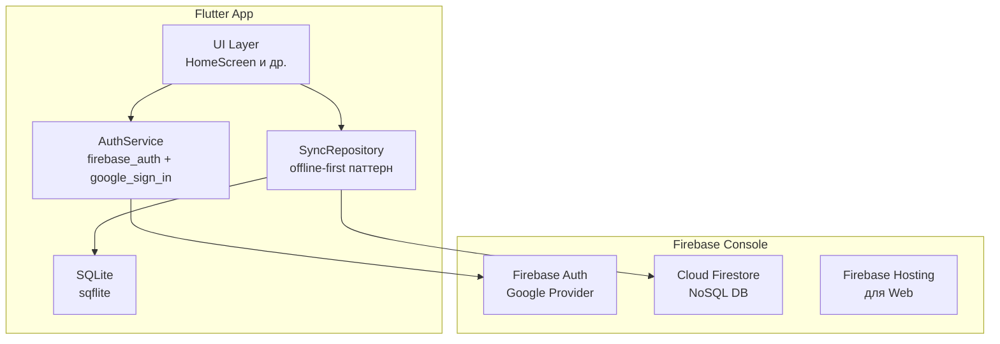
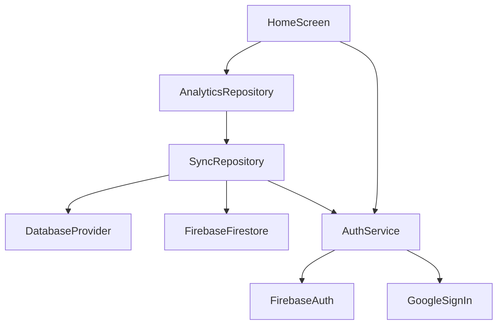

# План: Google Auth + Синхронизация данных (Firebase)

## Цель
Добавить регистрацию через Google аккаунт и синхронизацию данных между устройствами (Android, iOS, Web) **без аренды сервера**, используя Firebase (бесплатный Spark Plan).

---

## 1. Общая архитектура



### Ключевые принципы

1. **Offline-first** — все данные сначала пишутся в локальный SQLite, затем синхронизируются с Firestore
2. **Firestore как единый источник правды** после синхронизации
3. **Google Auth** — через [`firebase_auth`](https://pub.dev/packages/firebase_auth) + [`google_sign_in`](https://pub.dev/packages/google_sign_in)
4. **Бесплатно** — Firebase Spark Plan (50k MAU, 1GB storage, 50k reads/day)

---

## 2. Структура Firestore

```
users/{userId}/
  ├── profile: {
  │     displayName: "Иван",
  │     email: "ivan@gmail.com",
  │     photoUrl: "https://...",
  │     createdAt: "2026-05-13T15:00:00Z"
  │   }
  │
  ├── sessions/{sessionId}/
  │     seconds: 1800,
  │     timestamp: "2026-05-13T15:00:00Z",
  │     note: "Спокойная медитация",
  │     moodRating: 4,
  │     tag: "Утро"
  │
  └── metadata: {
        lastSyncAt: "2026-05-13T15:00:00Z",
        totalMinutes: 450,
        sessionCount: 25
      }
```

---

## 3. Пошаговый план реализации

### Шаг 1: Создать Firebase проект и подключить приложения

**Что сделать:**
1. Перейти на [Firebase Console](https://console.firebase.google.com)
2. Создать проект (например, `axismind`)
3. Добавить **Android** приложение:
   - Пакет: `com.axismind.app` (из [`android/app/build.gradle.kts`](android/app/build.gradle.kts))
   - Скачать `google-services.json` → положить в `android/app/`
4. Добавить **iOS** приложение:
   - Bundle ID: `com.axismind.app` (из [`ios/Runner/Info.plist`](ios/Runner/Info.plist))
   - Скачать `GoogleService-Info.plist` → положить в `ios/Runner/`
5. Добавить **Web** приложение:
   - Название: `axismind-web`
   - Скопировать конфигурацию Firebase в `web/index.html`
6. Включить **Google** как провайдер в Firebase Auth
7. Включить **Cloud Firestore** (тестовый режим, потом — правила безопасности)

**Файлы для изменения:**
- `android/app/google-services.json` — новый файл
- `ios/Runner/GoogleService-Info.plist` — новый файл
- `web/index.html` — добавить Firebase SDK конфиг

---

### Шаг 2: Добавить зависимости в pubspec.yaml

**Новые пакеты:**
```yaml
dependencies:
  firebase_core: ^3.12.0
  firebase_auth: ^5.5.0
  google_sign_in: ^6.3.0
  cloud_firestore: ^5.6.0
  firebase_storage: ^12.4.0  # опционально, для аватарок
```

**Файлы для изменения:**
- [`pubspec.yaml`](pubspec.yaml) — добавить зависимости
- Запустить `flutter pub get`

---

### Шаг 3: Инициализировать Firebase в main.dart

**Что изменить в [`lib/main.dart`](lib/main.dart):**
```dart
import 'package:firebase_core/firebase_core.dart';

void main() async {
  WidgetsFlutterBinding.ensureInitialized();
  await Firebase.initializeApp(
    options: DefaultFirebaseOptions.currentPlatform,
  );
  // ... остальная инициализация
}
```

Для Web потребуется сгенерировать `firebase_options.dart` через:
```
flutterfire configure
```

**Файлы для изменения:**
- [`lib/main.dart`](lib/main.dart) — добавить `Firebase.initializeApp()`
- `lib/firebase_options.dart` — сгенерируется автоматически

---

### Шаг 4: Создать AuthService

**Новый файл:** `lib/services/auth_service.dart`

```dart
import 'package:firebase_auth/firebase_auth.dart';
import 'package:google_sign_in/google_sign_in.dart';

class AuthService {
  final FirebaseAuth _auth = FirebaseAuth.instance;
  final GoogleSignIn _googleSignIn = GoogleSignIn();

  /// Поток состояния аутентификации
  Stream<User?> get authStateChanges => _auth.authStateChanges();

  /// Текущий пользователь
  User? get currentUser => _auth.currentUser;

  /// Войти через Google
  Future<User?> signInWithGoogle() async {
    final GoogleSignInAccount? googleUser = await _googleSignIn.signIn();
    if (googleUser == null) return null; // пользователь отменил

    final GoogleSignInAuthentication googleAuth =
        await googleUser.authentication;

    final credential = GoogleAuthProvider.credential(
      accessToken: googleAuth.accessToken,
      idToken: googleAuth.idToken,
    );

    final UserCredential userCredential =
        await _auth.signInWithCredential(credential);

    return userCredential.user;
  }

  /// Выйти
  Future<void> signOut() async {
    await _googleSignIn.signOut();
    await _auth.signOut();
  }
}
```

**Файлы для создания:**
- `lib/services/auth_service.dart`

---

### Шаг 5: Создать SyncRepository (offline-first синхронизация)

**Новый файл:** `lib/data/sync_repository.dart`

Этот репозиторий будет обёрткой над существующим [`DatabaseProvider`](lib/data/database_provider.dart) и Firestore.

**Принцип работы:**
1. **Запись**: пишем в SQLite → пушим в Firestore (с обработкой ошибок сети)
2. **Чтение**: читаем из SQLite (быстро) → фоново обновляем из Firestore
3. **Миграция**: при первом входе — загружаем все локальные данные в Firestore

```dart
class SyncRepository {
  final DatabaseProvider _localDb;
  final FirebaseFirestore _firestore;
  final AuthService _auth;

  /// Сохранить сессию (локально + облако)
  Future<void> saveSession(Session session) async {
    // 1. Сначала в локальную БД
    await _localDb.insertSession(session);

    // 2. Потом в Firestore (если пользователь авторизован)
    final user = _auth.currentUser;
    if (user != null) {
      try {
        await _firestore
            .collection('users')
            .doc(user.uid)
            .collection('sessions')
            .doc(session.id)
            .set(session.toMap());
      } catch (e) {
        // Ошибка сети — данные уже сохранены локально,
        // синхронизируем при следующем входе
        debugPrint('Firestore sync failed (offline): $e');
      }
    }
  }

  /// Загрузить сессии (локально + обновить из облака)
  Future<List<Session>> getSessions({int limit = 20, int offset = 0}) async {
    // 1. Сначала из локальной БД (мгновенно)
    final localSessions = await _localDb.getAllSessions(
      limit: limit,
      offset: offset,
    );

    // 2. Фоново обновить из Firestore (если авторизован)
    final user = _auth.currentUser;
    if (user != null) {
      _syncFromCloud(user.uid);
    }

    return localSessions;
  }

  /// Фоновая синхронизация из облака в локальную БД
  Future<void> _syncFromCloud(String userId) async {
    try {
      final cloudSessions = await _firestore
          .collection('users')
          .doc(userId)
          .collection('sessions')
          .get();

      for (final doc in cloudSessions.docs) {
        final session = Session.fromMap(doc.data());
        await _localDb.insertSession(session);
      }
    } catch (e) {
      debugPrint('Cloud sync failed: $e');
    }
  }

  /// Миграция локальных данных в облако (при первом входе)
  Future<void> migrateLocalToCloud(String userId) async {
    final localSessions = await _localDb.getAllSessions();
    final batch = _firestore.batch();

    for (final session in localSessions) {
      final docRef = _firestore
          .collection('users')
          .doc(userId)
          .collection('sessions')
          .doc(session.id);
      batch.set(docRef, session.toMap());
    }

    await batch.commit();
  }
}
```

**Файлы для создания:**
- `lib/data/sync_repository.dart`

---

### Шаг 6: Рефакторинг AnalyticsRepository

**Что изменить в [`lib/data/analytics_repository.dart`](lib/data/analytics_repository.dart):**

Заменить прямое использование [`DatabaseProvider`](lib/data/database_provider.dart) на [`SyncRepository`](lib/data/sync_repository.dart):

```dart
class AnalyticsRepository {
  final SyncRepository _syncRepo;

  AnalyticsRepository(this._syncRepo);

  Future<void> saveSession(int seconds) async {
    final session = Session(seconds: seconds);
    await _syncRepo.saveSession(session);
  }

  Future<List<Session>> getJournalSessions({int limit = 20, int offset = 0}) async {
    return _syncRepo.getSessions(limit: limit, offset: offset);
  }
  // ... остальные методы аналогично
}
```

**Файлы для изменения:**
- [`lib/data/analytics_repository.dart`](lib/data/analytics_repository.dart)

---

### Шаг 7: Добавить UI — экран входа и кнопку в профиле

**Новый файл:** `lib/screens/auth_screen.dart`

```dart
class AuthScreen extends StatelessWidget {
  Widget build(BuildContext context) {
    return Scaffold(
      body: Center(
        child: Column(
          mainAxisAlignment: MainAxisAlignment.center,
          children: [
            Text('AxisMind', style: ...),
            SizedBox(height: 32),
            ElevatedButton.icon(
              icon: Icon(Icons.login),
              label: Text('Войти через Google'),
              onPressed: () async {
                final user = await AuthService().signInWithGoogle();
                if (user != null) {
                  // Миграция локальных данных в облако
                  await SyncRepository().migrateLocalToCloud(user.uid);
                  Navigator.pushReplacement(context, HomeScreen());
                }
              },
            ),
          ],
        ),
      ),
    );
  }
}
```

**Изменения в [`lib/screens/home_screen.dart`](lib/screens/home_screen.dart):**
- Добавить аватар пользователя и кнопку "Войти" / имя пользователя в AppBar или в hero-секцию
- Если пользователь не авторизован — показывать кнопку "Войти через Google"
- Если авторизован — показывать аватар, имя и кнопку "Выйти"

**Файлы для создания:**
- `lib/screens/auth_screen.dart`

**Файлы для изменения:**
- [`lib/screens/home_screen.dart`](lib/screens/home_screen.dart) — добавить секцию профиля

---

### Шаг 8: Настроить Firebase Hosting для Web

**Что сделать:**
1. Установить Firebase CLI: `npm install -g firebase-tools`
2. Войти: `firebase login`
3. Инициализировать: `firebase init hosting`
   - Выбрать проект `axismind`
   - Public directory: `build/web`
   - Single-page app: yes
4. Собрать Web: `flutter build web`
5. Задеплоить: `firebase deploy --only hosting`

**Файлы для создания:**
- `firebase.json` — конфигурация хостинга
- `.firebaserc` — привязка к проекту

---

### Шаг 9: Настроить правила безопасности Firestore

**В Firebase Console → Firestore → Rules:**

```
rules_version = '2';
service cloud.firestore {
  match /databases/{database}/documents {
    // Только авторизованный пользователь может читать/писать свои данные
    match /users/{userId}/{document=**} {
      allow read, write: if request.auth != null 
                        && request.auth.uid == userId;
    }
  }
}
```

---

## 4. Схема зависимостей (DI)



**Рекомендация:** использовать простой Service Locator или передавать зависимости через конструкторы (как уже сделано в проекте).

---

## 5. Бесплатные лимиты Firebase Spark Plan

| Ресурс | Лимит | Для AxisMind |
|---|---|---|
| Firebase Auth (MAU) | 50 000 | ✅ Более чем достаточно |
| Firestore reads/day | 50 000 | ✅ ~100 reads/день при 50 сессиях |
| Firestore writes/day | 20 000 | ✅ ~50 writes/день |
| Firestore storage | 1 GB | ✅ Текст — ничтожно мало |
| Firebase Hosting | 10 GB storage, 360 MB/day | ✅ Бесплатно |

---

## 6. Риски и альтернативы

### Риски
1. **Firebase заблокирован в РФ** — если пользователи из России, Firebase может быть недоступен
2. **Лимиты Spark Plan** — при >50k MAU придётся перейти на Blaze (pay-as-you-go)
3. **Конфликты синхронизации** — если пользователь медитирует на двух устройствах одновременно

### Альтернатива: Supabase (если Firebase недоступен)
- Бесплатный PostgreSQL (500 MB)
- Встроенная Google Auth
- Требует больше ручной работы с синхронизацией
- Нет встроенного offline-first (нужно реализовать самим)

---

## 7. Итоговый список файлов для создания/изменения

### Новые файлы:
| Файл | Назначение |
|---|---|
| `lib/services/auth_service.dart` | Google-аутентификация |
| `lib/data/sync_repository.dart` | Offline-first синхронизация |
| `lib/screens/auth_screen.dart` | Экран входа через Google |
| `android/app/google-services.json` | Конфиг Firebase для Android |
| `ios/Runner/GoogleService-Info.plist` | Конфиг Firebase для iOS |
| `lib/firebase_options.dart` | Авто-сгенерированный конфиг |
| `firebase.json` | Конфиг Firebase Hosting |
| `.firebaserc` | Привязка к Firebase проекту |

### Изменяемые файлы:
| Файл | Изменения |
|---|---|
| [`pubspec.yaml`](pubspec.yaml) | Добавить firebase_core, firebase_auth, google_sign_in, cloud_firestore |
| [`lib/main.dart`](lib/main.dart) | Добавить Firebase.initializeApp() |
| [`lib/data/analytics_repository.dart`](lib/data/analytics_repository.dart) | Перейти с DatabaseProvider на SyncRepository |
| [`lib/screens/home_screen.dart`](lib/screens/home_screen.dart) | Добавить секцию профиля / кнопку входа |
| [`web/index.html`](web/index.html) | Добавить Firebase SDK конфиг |
