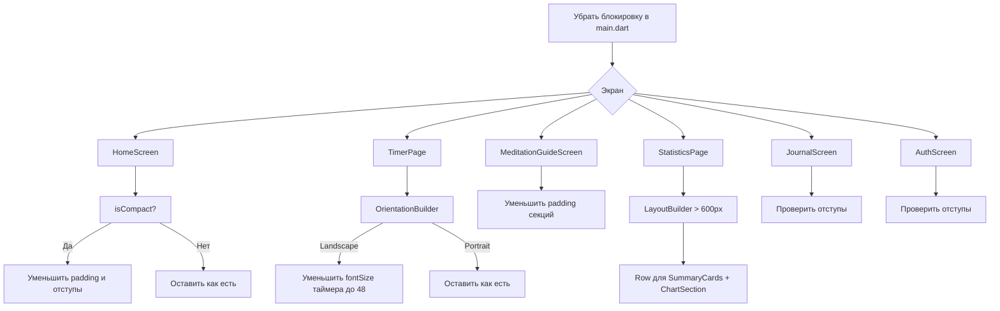

# План: поддержка ландшафтного режима (Landscape)

## Анализ текущего состояния

### Блокировка
- [`main.dart:21-24`](../lib/main.dart:21) — `SystemChrome.setPreferredOrientations([portraitUp, portraitDown])` — **нужно удалить**
- [`AndroidManifest.xml:12`](../android/app/src/main/AndroidManifest.xml:12) — `android:configChanges` уже включает `orientation|screenSize` — **менять не нужно**

### Анализ экранов

#### 1. [`HomeScreen`](../lib/screens/home_screen.dart) — mobile layout
- Использует `SingleChildScrollView` + `Column` с центрированием
- `ConstrainedBox(minHeight: MediaQuery.of(context).size.height)` — в ландшафте высота экрана мала, контент может не поместиться
- `LayoutBuilder` уже есть, но `isCompact` (maxHeight < 600) не используется для смены расположения
- **Проблема:** Hero-карточка + пресеты + кнопки в один столбец не влезут в ландшафт на телефоне
- **Решение:** При `isCompact` (ландшафт на телефоне) — переключиться на горизонтальный `Row` или `Wrap` для пресетов, уменьшить отступы

#### 2. [`TimerPage`](../lib/screens/timer_page.dart)
- Центрированный `Column` с таймером, подсказкой и кнопками
- `SafeArea` уже есть
- **Проблема:** В ландшафте таймер (72px шрифт) + прогресс-бар + подсказка + кнопки в один столбец — слишком высоко для窄кого экрана
- **Решение:** При ландшафте — расположить таймер и кнопки в `Row` (слева таймер, справа кнопки), либо уменьшить размер шрифта

#### 3. [`MeditationGuideScreen`](../lib/screens/meditation_guide_screen.dart)
- `SingleChildScrollView` + `Center` + `SizedBox(width: min(600, screenWidth))`
- **Проблем:** В ландшафте ширина 600px нормально смотрится, но секции с `Row` (например, карточки Дзадзен) могут быть слишком сжаты по высоте
- **Решение:** Минимальных изменений — `SingleChildScrollView` уже спасает. Возможно, уменьшить padding в ландшафте

#### 4. [`StatisticsPage`](../lib/screens/statistics_page.dart) + [`StaggeredDashboard`](../lib/screens/widgets/staggered_dashboard.dart)
- `AppBar` + `BlocBuilder` → `StaggeredDashboard`
- `StaggeredDashboard` использует `Column` с секциями (HeroSection, SummaryCards, ChartSection, HeatmapSection)
- **Проблема:** В ландшафте графики и тепловая карта могут быть слишком узкими
- **Решение:** Использовать `LayoutBuilder` внутри `StaggeredDashboard` — при ширине > 600px переключать `HeatmapSection` и `ChartSection` в `Row` (рядом), а не в `Column`

#### 5. [`JournalScreen`](../lib/screens/journal_screen.dart)
- `ListView` с записями — стандартный список
- **Проблем:** Минимальная — `ListView` адаптируется автоматически
- **Решение:** Только проверить, что `SearchBar` и фильтры не уезжают

#### 6. [`AuthScreen`](../lib/screens/auth_screen.dart)
- `Center` + `SingleChildScrollView` + `Column`
- **Проблем:** Минимальная — контент центрирован, скролл есть
- **Решение:** Только проверить отступы

## План изменений

### Шаг 1: Убрать блокировку ориентации
**Файл:** [`main.dart`](../lib/main.dart)
- Удалить `SystemChrome.setPreferredOrientations(...)` целиком (строки 21-25)

### Шаг 2: Адаптировать HomeScreen mobile layout
**Файл:** [`home_screen.dart`](../lib/screens/home_screen.dart)
- В `_buildMobileLayout` при `isCompact` (ландшафт):
  - Уменьшить `padding` с `zen.spacingUnit * 4` до `zen.spacingUnit * 2`
  - Уменьшить `SizedBox` отступы между секциями
  - Пресеты длительности (`_buildDurationPresets`) — использовать `Wrap` с меньшим `spacing`
  - Убрать `ConstrainedBox(minHeight: ...)` — он заставляет контент быть выше экрана

### Шаг 3: Адаптировать TimerPage
**Файл:** [`timer_page.dart`](../lib/screens/timer_page.dart)
- В `build()` добавить `LayoutBuilder` или `OrientationBuilder`
- При `orientation == Landscape`:
  - Уменьшить `fontSize` таймера с 72 до 48
  - Уменьшить `padding` карточки таймера
  - Расположить `_buildControls` горизонтально рядом с таймером (или оставить как есть, но уменьшить отступы)

### Шаг 4: Адаптировать MeditationGuideScreen
**Файл:** [`meditation_guide_screen.dart`](../lib/screens/meditation_guide_screen.dart)
- Уменьшить `padding` секций в ландшафте
- Уменьшить `fontSize` заголовков (с 48 до 32) при ландшафте

### Шаг 5: Адаптировать StaggeredDashboard (Statistics)
**Файл:** [`staggered_dashboard.dart`](../lib/screens/widgets/staggered_dashboard.dart)
- Добавить `LayoutBuilder` — при ширине > 600px:
  - `SummaryCards` и `ChartSection` в `Row` (2 колонки)
  - `HeatmapSection` на всю ширину внизу

### Шаг 6: Проверить JournalScreen и AuthScreen
- Минимальные изменения — только проверить отступы

### Шаг 7: Собрать APK
- `flutter build apk --release`

## Схема адаптации

