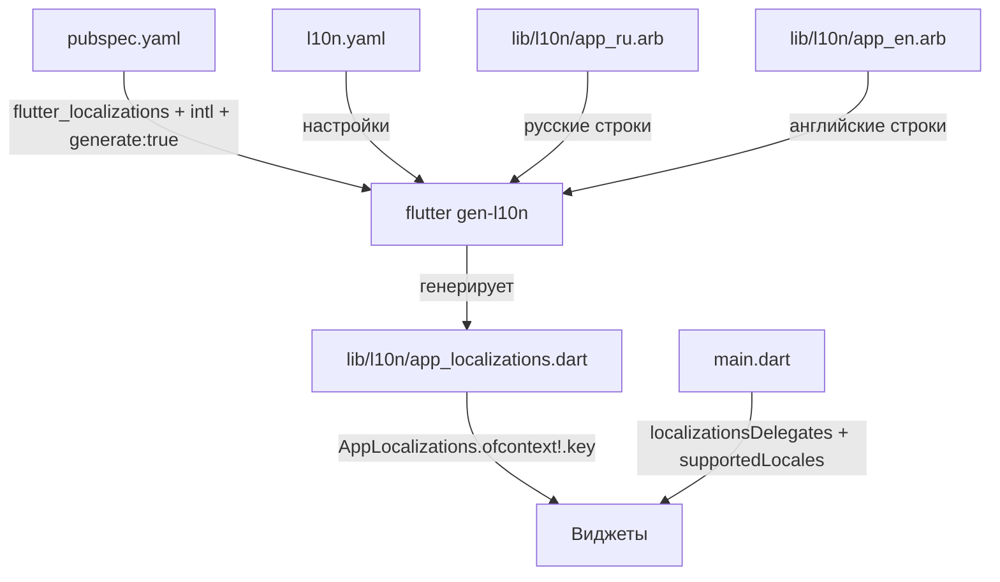

# План локализации AxisMind (RU/EN)

STATUS: ✅ Реализовано (v2.2.0, ARB RU/EN).

## Обзор

Перевод приложения на русский (RU) и английский (EN) через официальный Flutter-метод с ARB-файлами.

## Архитектура



## Шаг 1: pubspec.yaml

Добавить в `dependencies`:
```yaml
dependencies:
  flutter:
    sdk: flutter
  flutter_localizations:
    sdk: flutter
  intl: ^0.19.0
```

Добавить в `flutter:` секцию:
```yaml
flutter:
  generate: true
```

## Шаг 2: l10n.yaml

```yaml
arb-dir: lib/l10n
template-arb-file: app_en.arb
output-localization-file: app_localizations.dart
output-class: AppLocalizations
preferred-supported-locales:
  - en
  - ru
use-deferred-loading: false
synthetic-package: false
```

## Шаг 3: ARB-файлы

### app_en.arb (шаблон, ~150 ключей)

Все ключи в lowerCamelCase. Основные категории:

| Категория | Примеры ключей |
|-----------|---------------|
| **Навигация** | `practice`, `journal`, `statistics`, `guide`, `notifications` |
| **Пресеты длительности** | `presetQuick`, `presetStandard`, `presetDeep`, `presetMaster` |
| **Подписка (Paywall)** | `paywallTitle`, `paywallTrial`, `paywallPurchase`, `paywallRestore`, `paywallContinue` |
| **Дневник** | `journalTitle`, `journalEdit`, `journalMood`, `journalNote`, `journalTag`, `journalSave`, `journalSkip` |
| **Цели** | `goalsTitle`, `goalsSetup`, `goalsAdd`, `goalsEdit`, `goalsDelete`, `goalsNoGoals` |
| **Уведомления** | `notifTitle`, `notifGeneral`, `notifReminder`, `notifMotivation`, `notifGoals`, `notifQuietHours` |
| **Статистика** | `statsTitle`, `statsTotalMinutes`, `statsSessions`, `statsStreak`, `statsGrowth`, `statsAverage`, `statsBest` |
| **Гайд по медитации** | `guideTitle`, `guideSubtitle`, `guideTechnique`, `guidePosture`, `guideGaze`, `guideFocus`, `guideAlgorithm` |
| **Ранги** | `rankNovice`, `rankSeeker`, `rankGuardian`, `rankMaster`, `rankWanderer`, `rankAwakened`, `rankSage`, `rankEnlightened`, `rankLegend`, `rankImmortal`, `rankDivine` |
| **Теги дневника** | `tagMorning`, `tagDay`, `tagEvening`, `tagStress`, `tagCalm`, `tagGratitude` |
| **Типы целей** | `goalDailyMinutes`, `goalWeeklySessions`, `goalWeeklyMinutes`, `goalStreakDays` |
| **Типы уведомлений** | `notifTypeReminder`, `notifTypeMotivation`, `notifTypeGoal`, `notifTypeStreak` |
| **Ошибки** | `errorDatabase`, `errorNetwork`, `errorStats`, `errorPurchase`, `errorRestore`, `errorNoPurchases` |
| **Кнопки** | `startPractice`, `continue`, `save`, `cancel`, `delete`, `retry`, `skip`, `close`, `done` |
| **Аутентификация** | `authGoogle`, `authContinueWithout`, `authTitle`, `authSubtitle` |
| **Мотивационные цитаты** | `quote1`..`quote15` (15 цитат) |
| **Дни недели** | `daySun`..`daySat` |
| **Месяцы** | `monthJan`..`monthDec` |
| **Premium** | `premiumActive`, `premium` |

### app_ru.arb

Содержит те же ключи, что и app_en.arb, но с русскими значениями (текущие строки из кода).

## Шаг 4: main.dart

```dart
import 'package:flutter_localizations/flutter_localizations.dart';
import 'l10n/app_localizations.dart';

// В MaterialApp:
MaterialApp(
  localizationsDelegates: const [
    AppLocalizations.delegate,
    GlobalMaterialLocalizations.delegate,
    GlobalWidgetsLocalizations.delegate,
    GlobalCupertinoLocalizations.delegate,
  ],
  supportedLocales: const [
    Locale('en'),
    Locale('ru'),
  ],
  localeResolutionCallback: (locale, supportedLocales) {
    // Если язык не поддерживается — английский
    for (final supported in supportedLocales) {
      if (supported.languageCode == locale?.languageCode) {
        return supported;
      }
    }
    return const Locale('en');
  },
)
```

## Шаг 5: Замена строк в виджетах

### Файлы для модификации (в порядке приоритета):

| Файл | Количество строк | Сложность |
|------|-----------------|-----------|
| `lib/screens/paywall_screen.dart` | ~25 строк | Средняя |
| `lib/screens/home_screen.dart` | ~20 строк | Средняя |
| `lib/screens/meditation_guide_screen.dart` | ~40 строк | Высокая (много контента) |
| `lib/screens/notification_settings_screen.dart` | ~35 строк | Средняя |
| `lib/screens/journal_screen.dart` | ~15 строк | Средняя |
| `lib/screens/goal_settings_screen.dart` | ~20 строк | Средняя |
| `lib/screens/auth_screen.dart` | ~10 строк | Низкая |
| `lib/screens/statistics_page.dart` | ~2 строки | Низкая |
| `lib/screens/timer_page.dart` | ~10 строк | Средняя |
| `lib/widgets/journal_dialog.dart` | ~15 строк | Средняя |
| `lib/widgets/empty_dashboard.dart` | ~4 строки | Низкая |
| `lib/widgets/error_view.dart` | ~8 строк | Средняя |
| `lib/widgets/goal_completed_notification.dart` | ~3 строки | Низкая |
| `lib/widgets/level_up_dialog.dart` | ~3 строки | Низкая |
| `lib/widgets/subscription_guard.dart` | ~2 строки | Низкая |
| `lib/screens/widgets/nav_sidebar.dart` | ~8 строк | Низкая |
| `lib/screens/widgets/widescreen_layout.dart` | ~10 строк | Средняя |
| `lib/screens/widgets/glassmorphic_hero.dart` | ~5 строк | Низкая |
| `lib/screens/widgets/goals_panel.dart` | ~8 строк | Средняя |
| `lib/screens/widgets/heatmap_section.dart` | ~6 строк | Низкая |
| `lib/screens/widgets/chart_section.dart` | ~3 строки | Низкая |
| `lib/screens/widgets/summary_cards.dart` | ~8 строк | Средняя |
| `lib/screens/widgets/rank_roadmap.dart` | ~10 строк | Средняя |
| `lib/screens/widgets/hero_section.dart` | ~3 строки | Низкая |
| `lib/screens/widgets/staggered_dashboard.dart` | ~2 строки | Низкая |
| `lib/domain/progress_calculator.dart` | ~22 строки (ранги) | Средняя |
| `lib/data/meditation_goal.dart` | ~4 строки (типы целей) | Низкая |
| `lib/data/notification_settings.dart` | ~8 строк | Низкая |
| `lib/utils/time_utils.dart` | ~1 строка (дни недели) | Низкая |
| `lib/services/notification_service.dart` | ~30 строк (каналы + цитаты) | Высокая |
| `lib/services/auth_service.dart` | ~1 строка | Низкая |

### Паттерн замены:

**Было:**
```dart
Text('НАЧАТЬ ПРАКТИКУ'),
```

**Стало:**
```dart
Text(AppLocalizations.of(context)!.startPractice),
```

Для строк с интерполяцией:
```dart
Text('Уровень ${event.level}'),
// Станет:
Text('${AppLocalizations.of(context)!.level} ${event.level}'),
```

## Шаг 6: Генерация и проверка

```bash
flutter gen-l10n
flutter analyze
flutter test
flutter build apk --release
```

## Важные замечания

1. **Строки в debugPrint** — НЕ локализуем, они только для разработчика
2. **Строки в DatabaseException** — НЕ локализуем, это внутренние ошибки
3. **Мотивационные цитаты** (15 шт) — переводим на английский с сохранением смысла
4. **Названия каналов уведомлений** — локализуем (Android показывает их пользователю)
5. **Дни недели и месяцы** — локализуем через ARB (не через intl DateFormat, чтобы сохранить короткую форму)
6. **Ранги** — переводим с mindfulness-терминологией:
   - Новичок осознанности → Mindfulness Novice
   - Искатель спокойствия → Peace Seeker
   - Хранитель тишины → Silence Guardian
   - Мастер баланса → Balance Master
   - Странник глубин → Depth Wanderer
   - Пробуждённый → Awakened One
   - Мудрец → Sage
   - Просветлённый → Enlightened One
   - Легенда → Legend
   - Бессмертный → Immortal
   - Божественный → Divine
