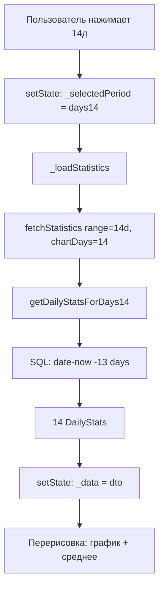

# План: Переключатель периода для графика статистики

## Проблема
Сейчас график на странице статистики всегда показывает данные за последние 7 дней. Нужно добавить переключатель на 7 / 14 / 30 дней.

## Текущая архитектура

### Загрузка данных
- [`AnalyticsRepository.fetchStatistics(DateRange range)`](lib/data/analytics_repository.dart:303) — загружает всю статистику
- Внутри вызывает `getLast7Days()` (хардкод 7 дней) и `getHeatmapData(days: 30)` (хардкод 30)
- `getLast7Days()` → `_dbProvider.getDailyMinutes(7)` — SQL с CTE для генерации дат

### Отображение
- [`_buildChartSection`](lib/screens/statistics_page.dart:668) — секция с заголовком "Последние 7 дней" и графиком
- [`_buildAreaChart`](lib/screens/statistics_page.dart:697) — сам `LineChart`
- [`_buildAverageMetric`](lib/screens/statistics_page.dart:902) — блок "В среднем в день" (считает average из `dto.dailyStats`)
- [`_buildHeatmapSection`](lib/screens/statistics_page.dart:451) — heatmap за 30 дней (остаётся без изменений)

### Данные
- `ExtendedStatisticsDTO.dailyStats` — `List<DailyStats>` (всегда 7 записей)
- `DailyStats` — `date`, `minutes`, `shortLabel`, `dayLabel`

## План изменений

### Шаг 1: AnalyticsRepository — добавить `getDailyStatsForDays(int days)`

**Файл**: [`lib/data/analytics_repository.dart`](lib/data/analytics_repository.dart)

Добавить метод:
```dart
Future<List<DailyStats>> getDailyStatsForDays(int days) async {
  final rows = await _dbProvider.getDailyMinutes(days);
  return rows.map((row) {
    return DailyStats(
      date: row['date'] as String,
      minutes: (row['minutes'] as num).toDouble(),
    );
  }).toList();
}
```

Метод `_dbProvider.getDailyMinutes(int days)` **уже существует** и работает для любого количества дней (использует `date('now', 'localtime', '-${days - 1} days')`).

### Шаг 2: StatisticsPage — добавить состояние периода

**Файл**: [`lib/screens/statistics_page.dart`](lib/screens/statistics_page.dart)

1. Добавить enum:
```dart
enum _ChartPeriod { days7, days14, days30 }
```

2. Добавить поле в `_StatisticsPageState`:
```dart
_ChartPeriod _selectedPeriod = _ChartPeriod.days7;
```

3. Обновить `_loadStatistics()` — передавать период в `fetchStatistics`:
```dart
Future<void> _loadStatistics() async {
  // ...
  final days = _selectedPeriod == _ChartPeriod.days7 ? 7
      : _selectedPeriod == _ChartPeriod.days14 ? 14
      : 30;
  final start = DateTime(now.year, now.month, now.day - (days - 1));
  final range = DateRange(start: start, end: now);
  final result = await _repository!.fetchStatistics(range, chartDays: days);
  // ...
}
```

4. Обновить `fetchStatistics` — принимать параметр `chartDays`:
```dart
Future<AnalyticsResult<ExtendedStatisticsDTO>> fetchStatistics(
  DateRange range, {
  int chartDays = 7,
}) async {
  // ...
  final dailyStats = await getDailyStatsForDays(chartDays);
  // ...
}
```

5. Добавить переключатель в `_buildChartSection`:
```dart
Widget _buildChartSection(ThemeData theme, ZenStyles zen, ExtendedStatisticsDTO dto) {
  return ZenSurface(
    child: Column(
      crossAxisAlignment: CrossAxisAlignment.start,
      children: [
        // Заголовок + переключатель
        Row(
          mainAxisAlignment: MainAxisAlignment.spaceBetween,
          children: [
            Text('Последние $days дней', ...),
            _buildPeriodToggle(theme, zen),
          ],
        ),
        SizedBox(height: zen.gap(2)),
        SizedBox(height: 240, child: _buildAreaChart(theme, dto.dailyStats)),
      ],
    ),
  );
}
```

6. Добавить виджет `_buildPeriodToggle`:
```dart
Widget _buildPeriodToggle(ThemeData theme, ZenStyles zen) {
  return ToggleButtons(
    isSelected: [
      _selectedPeriod == _ChartPeriod.days7,
      _selectedPeriod == _ChartPeriod.days14,
      _selectedPeriod == _ChartPeriod.days30,
    ],
    onPressed: (index) {
      setState(() {
        _selectedPeriod = _ChartPeriod.values[index];
        _loadStatistics();
      });
    },
    borderRadius: BorderRadius.circular(zen.cardRadius / 2),
    constraints: const BoxConstraints(minWidth: 36, minHeight: 28),
    textStyle: theme.textTheme.bodySmall?.copyWith(fontSize: 11),
    selectedColor: theme.colorScheme.primary,
    fillColor: theme.colorScheme.primary.withValues(alpha: 0.1),
    children: const [
      Text('7д'),
      Text('14д'),
      Text('30д'),
    ],
  );
}
```

7. Обновить заголовок графика — динамический:
```dart
final days = _selectedPeriod == _ChartPeriod.days7 ? 7
    : _selectedPeriod == _ChartPeriod.days14 ? 14
    : 30;
Text('Последние $days дней', ...)
```

8. Обновить `_buildAverageMetric` — она уже использует `dto.dailyStats`, так что будет автоматически показывать среднее за выбранный период.

### Шаг 3: Обновить `fetchStatistics` сигнатуру

**Файл**: [`lib/data/analytics_repository.dart`](lib/data/analytics_repository.dart)

Изменить `fetchStatistics`:
- Добавить параметр `int chartDays = 7`
- Заменить `getLast7Days()` на `getDailyStatsForDays(chartDays)`
- Убрать `getLast7Days()` если он больше нигде не используется (проверить)

## Схема потока данных



## Что НЕ меняется
- Heatmap (всегда 30 дней) — остаётся как есть
- Hero-секция, summary cards, streak/growth — не зависят от периода
- `_buildAverageMetric` — автоматически использует `dto.dailyStats`
- `_getPreviousWeekMinutes` — остаётся для growth (сравнение с предыдущей неделей)
