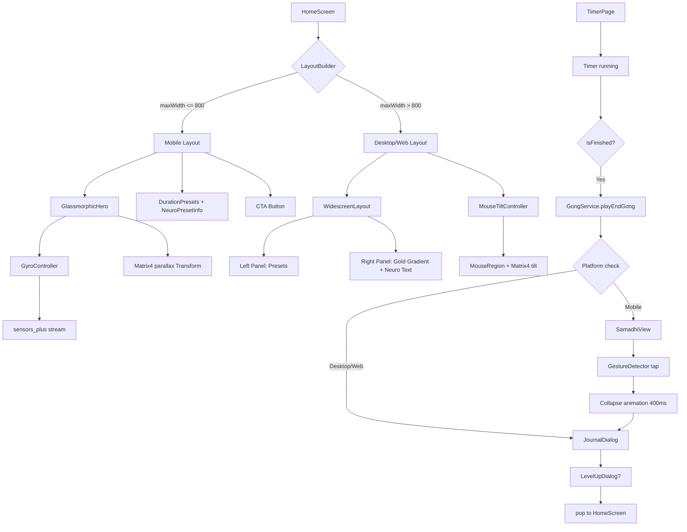

# План рефакторинга AxisMind v2.0.0 — Премиум-экраны

## Общая архитектура

### Текущее состояние
- [`home_screen.dart`](lib/screens/home_screen.dart) — монолитный StatefulWidget с SingleTickerProviderStateMixin. Hero-секция (градиент, ранг, XP, streak), пресеты длительности, CTA-кнопка.
- [`timer_page.dart`](lib/screens/timer_page.dart) — экран медитации с таймером, гонгом, сохранением сессии, JournalDialog.
- Тема: [`ZenStyles`](lib/core/theme/zen_theme.dart) — светлая тема (фон `#F5F5F5`, primary `#4A90D9`).
- Платформенное разделение: минимальное (только `isWakelockSupported`).

### Целевое состояние
Фирменная палитра: фон `#0A192F`, золото `#C5A059`, шрифты PlayfairDisplay + Manrope.
Платформенное разделение через `LayoutBuilder` + `kIsWeb`.

---

## 1. Новая файловая структура

```
lib/
├── screens/
│   ├── home_screen.dart              # РЕФАКТОРИНГ
│   ├── timer_page.dart               # РЕФАКТОРИНГ
│   └── widgets/
│       ├── samadhi_view.dart         # НОВЫЙ — бесконечная фаза Самадхи
│       ├── samadhi_painter.dart      # НОВЫЙ — CustomPainter концентрических кругов
│       ├── glassmorphic_hero.dart    # НОВЫЙ — Hero-карточка с 3D-эффектом
│       ├── gyro_controller.dart      # НОВЫЙ — контроллер гироскопа (мобильные)
│       ├── mouse_tilt_controller.dart# НОВЫЙ — контроллер магнитного тилта (Desktop/Web)
│       ├── neuro_preset_info.dart    # НОВЫЙ — контекстные подсказки пресетов
│       ├── widescreen_layout.dart    # НОВЫЙ — Split-Layout для Desktop/Web
│       └── gold_gradient_painter.dart# НОВЫЙ — золотой градиент для правой панели
└── core/
    └── theme/
        └── zen_theme.dart            # РЕФАКТОРИНГ — новая тёмная палитра
```

---

## 2. Пошаговый план реализации

### Шаг 1. Рефакторинг темы (`zen_theme.dart`)
**Файл:** [`lib/core/theme/zen_theme.dart`](lib/core/theme/zen_theme.dart)

- Сменить цветовую схему на тёмную:
  - `scaffoldBackgroundColor` → `#0A192F`
  - `primary` → `#C5A059` (золото)
  - `onSurface` → `#E8E0D0` (тёплый светлый)
- Обновить `ZenStyles.defaults`:
  - `focusGradient` → тёмно-синий → глубокий индиго (`#0A192F` → `#0D2137`)
  - `cardRadius` → 32.0 (более премиальное скругление)
- TextTheme: PlayfairDisplay для заголовков, Manrope для body
- **Внимание:** `ZenTheme.build()` сейчас возвращает светлую тему. Нужно переписать на `Brightness.dark`.

### Шаг 2. Добавление зависимостей в `pubspec.yaml`
**Файл:** [`pubspec.yaml`](pubspec.yaml)

Добавить:
- `sensors_plus: ^6.1.1` — гироскоп для мобильных

### Шаг 3. GyroController (`gyro_controller.dart`) — Мобильная версия
**Новый файл:** [`lib/screens/widgets/gyro_controller.dart`](lib/screens/widgets/gyro_controller.dart)

- Класс `GyroController` с `StreamSubscription` из `sensors_plus`
- Low-pass filter: `smoothed = smoothed * 0.85 + raw * 0.15`
- Вычисление `tiltX`, `tiltY` в диапазоне `[-0.15, 0.15]`
- Метод `dispose()` — отписка от стрима
- **Важно:** Импорт `sensors_plus` только через условный импорт или проверку `kIsWeb` — на Web гироскоп не используется

### Шаг 4. MouseTiltController (`mouse_tilt_controller.dart`) — Desktop/Web
**Новый файл:** [`lib/screens/widgets/mouse_tilt_controller.dart`](lib/screens/widgets/mouse_tilt_controller.dart)

- Класс `MouseTiltController` с `ValueNotifier<Matrix4>`
- Метод `update(Offset localPosition, Size widgetSize)`:
  - Нормализация координат относительно центра виджета
  - Расчёт углов наклона по X/Y
  - Lerp-сглаживание (interpolation factor 0.08)
- Метод `reset()` — плавный возврат в исходное положение при уходе курсора

### Шаг 5. GlassmorphicHero (`glassmorphic_hero.dart`) — Мобильная версия
**Новый файл:** [`lib/screens/widgets/glassmorphic_hero.dart`](lib/screens/widgets/glassmorphic_hero.dart)

- Многослойный `Stack`:
  1. **Слой 1 (фон):** `BackdropFilter` + `ImageFilter.blur(sigmaX: 20, sigmaY: 20)` + золотая граница (opacity 0.15)
  2. **Слой 2 (золотое свечение):** `Transform` с `Matrix4` параллакса — золотой градиент, смещающийся в сторону наклона устройства
  3. **Слой 3 (контент):** Текстовый слой (ранг, XP, streak) — смещается в противоположную сторону наклона
- Интеграция `GyroController` для мобильных
- Интеграция `MouseTiltController` для Desktop/Web (через `MouseRegion`)
- Платформенное разделение: `if (kIsWeb || constraints.maxWidth > 800)` → MouseTilt, иначе → Gyro

### Шаг 6. NeuroPresetInfo (`neuro_preset_info.dart`)
**Новый файл:** [`lib/screens/widgets/neuro_preset_info.dart`](lib/screens/widgets/neuro_preset_info.dart)

- Виджет `NeuroPresetInfo` принимает `int minutes`
- `AnimatedSize` + `AnimatedSwitcher` для плавного раскрытия
- Маппинг текстов:
  - 5 → "Снижение активности дефолт-системы мозга..."
  - 10 → "Преодоление стадии адаптации..."
  - 15 → "Глубокое ментальное погружение..."
  - 20 → "Классический Дзадзен..."
- Стиль: PlayfairDisplay italic, золотой цвет `#C5A059` с opacity 0.8

### Шаг 7. SamadhiPainter (`samadhi_painter.dart`)
**Новый файл:** [`lib/screens/widgets/samadhi_painter.dart`](lib/screens/widgets/samadhi_painter.dart)

- `CustomPainter` для концентрических кругов
- Параметры: `double progress` (0.0–1.0, 8-секундный цикл), `double maxRadius`
- Рисование 5–7 концентрических окружностей золотого цвета `#C5A059`
- Пульсация: радиус каждой окружности = `maxRadius * (0.2 + i * 0.15) * (0.7 + 0.3 * sin(progress * 2π))`
- Opacity окружностей: затухание от центра к периферии
- `shouldRepaint` → true (анимированный)

### Шаг 8. SamadhiView (`samadhi_view.dart`)
**Новый файл:** [`lib/screens/widgets/samadhi_view.dart`](lib/screens/widgets/samadhi_view.dart)

- Полноэкранный виджет с фоном `#0A192F`
- `Ticker` для 8-секундного цикла пульсации
- `CustomPaint` с `SamadhiPainter`
- Текст цитаты "Когда ты отдаешь, ты на самом деле приобретаешь" — пульсирует синхронно с кругами (opacity + scale)
- `GestureDetector` на весь экран — по тапу:
  1. Запуск анимации схлопывания (400ms) — круги стягиваются в центр
  2. После завершения анимации — вызов `onExit` колбэка
- Desktop/Web: `RawKeyboardListener` + Space для выхода
- Desktop/Web: `maxRadius = MediaQuery.of(context).size.longestSide / 2`

### Шаг 9. WidescreenLayout (`widescreen_layout.dart`)
**Новый файл:** [`lib/screens/widgets/widescreen_layout.dart`](lib/screens/widgets/widescreen_layout.dart)

- `Row` с flex: 4 (левая панель) и flex: 6 (правая панель)
- **Левая панель:** вертикальный `Column` с пресетами времени (5, 10, 15, 20 мин)
- **Правая панель:** `AnimatedSwitcher` с вертикальным Motion Blur (`ImageFiltered`)
  - Контент: крупный текст нейробиологического обоснования поверх золотого градиента
  - При наведении/клике на пресет — смена контента

### Шаг 10. Рефакторинг `home_screen.dart`
**Файл:** [`lib/screens/home_screen.dart`](lib/screens/home_screen.dart)

- `LayoutBuilder` для определения платформы:
  - `constraints.maxWidth > 800` → Desktop/Web режим
  - Иначе → мобильный режим
- **Мобильный режим:**
  - Замена `_buildHeroSection` на `GlassmorphicHero`
  - Замена `_buildDurationPresets` — добавить `NeuroPresetInfo` под пресетами
  - CTA-кнопка с пульсацией остаётся
- **Desktop/Web режим:**
  - Использовать `WidescreenLayout`
  - `GlassmorphicHero` с `MouseTiltController`
- Импорт `dart:io` только под условием `!kIsWeb`

### Шаг 11. Рефакторинг `timer_page.dart`
**Файл:** [`lib/screens/timer_page.dart`](lib/screens/timer_page.dart)

- В `_onTimerTick` / `_saveSession`:
  - После `_gongService.playEndGong()` и перед `JournalDialog`:
  - Если `kIsWeb || defaultTargetPlatform != TargetPlatform.android && != TargetPlatform.iOS` → пропустить SamadhiView (или упрощённая версия)
  - Иначе → показать `SamadhiView` как полноэкранный оверлей
- `SamadhiView` вызывается через `Navigator.push` с прозрачным фоном или через `showGeneralDialog`
- После выхода из `SamadhiView` → открыть `JournalDialog`
- Desktop/Web: убрать Wakelock, добавить `RawKeyboardListener` для выхода

### Шаг 12. Обновление `pubspec.yaml` — финализация зависимостей
- Добавить `sensors_plus`
- Убедиться, что `wakelock_plus` остаётся (только для мобильных)

---

## 3. Архитектурная диаграмма



---

## 4. Ключевые технические решения

### Платформенное разделение
```dart
// В home_screen.dart
LayoutBuilder(
  builder: (context, constraints) {
    final isDesktop = kIsWeb || constraints.maxWidth > 800;
    if (isDesktop) {
      return _buildDesktopLayout(constraints);
    }
    return _buildMobileLayout(constraints);
  },
)
```

### Гироскоп (только мобильные)
```dart
// gyro_controller.dart
import 'package:sensors_plus/sensors_plus.dart';

class GyroController {
  StreamSubscription<GyroscopeEvent>? _subscription;
  double _smoothedX = 0, _smoothedY = 0;
  
  void start(void Function(double x, double y) onUpdate) {
    _subscription = gyroscopeEventStream().listen((event) {
      _smoothedX = _smoothedX * 0.85 + event.x * 0.15;
      _smoothedY = _smoothedY * 0.85 + event.y * 0.15;
      onUpdate(_smoothedX.clamp(-0.15, 0.15), _smoothedY.clamp(-0.15, 0.15));
    });
  }
  
  void dispose() => _subscription?.cancel();
}
```

### Магнитный тилт (Desktop/Web)
```dart
// mouse_tilt_controller.dart
class MouseTiltController extends ChangeNotifier {
  Matrix4 _transform = Matrix4.identity();
  Matrix4 get transform => _transform;
  
  void update(Offset localPos, Size size) {
    final center = Offset(size.width / 2, size.height / 2);
    final dx = (localPos.dx - center.dx) / center.dx; // -1..1
    final dy = (localPos.dy - center.dy) / center.dy; // -1..1
    
    final target = Matrix4.identity()
      ..setEntry(3, 2, 0.001)
      ..rotateX(dy * 0.1)
      ..rotateY(dx * 0.1);
    
    // Lerp smoothing
    _transform = Matrix4.identity();
    for (int i = 0; i < 16; i++) {
      _transform[i] = _transform[i] * 0.92 + target[i] * 0.08;
    }
    notifyListeners();
  }
}
```

### SamadhiView — бесконечная пульсация
```dart
// samadhi_view.dart
class _SamadhiViewState extends State<SamadhiView>
    with SingleTickerProviderStateMixin {
  late final AnimationController _pulseController;
  
  @override
  void initState() {
    super.initState();
    _pulseController = AnimationController(
      vsync: this,
      duration: const Duration(seconds: 8),
    )..repeat();
  }
  
  // progress = _pulseController.value (0.0..1.0)
  // Передаётся в SamadhiPainter
}
```

---

## 5. Порядок реализации (оптимальная последовательность)

| № | Задача | Зависимости | Файлы |
|---|--------|------------|-------|
| 1 | Рефакторинг темы | Нет | `zen_theme.dart` |
| 2 | Добавление `sensors_plus` | Нет | `pubspec.yaml` |
| 3 | GyroController | sensors_plus | `gyro_controller.dart` |
| 4 | MouseTiltController | Нет | `mouse_tilt_controller.dart` |
| 5 | GlassmorphicHero | GyroController, MouseTiltController | `glassmorphic_hero.dart` |
| 6 | NeuroPresetInfo | Нет | `neuro_preset_info.dart` |
| 7 | SamadhiPainter | Нет | `samadhi_painter.dart` |
| 8 | SamadhiView | SamadhiPainter | `samadhi_view.dart` |
| 9 | WidescreenLayout | NeuroPresetInfo | `widescreen_layout.dart` |
| 10 | Рефакторинг home_screen.dart | GlassmorphicHero, NeuroPresetInfo, WidescreenLayout | `home_screen.dart` |
| 11 | Рефакторинг timer_page.dart | SamadhiView, GongService | `timer_page.dart` |

---

## 6. Риски и компромиссы

1. **sensors_plus на Web:** Пакет `sensors_plus` не поддерживается на Web. Решение — условный импорт через `kIsWeb` и полное исключение гироскопа на Web/Desktop.
2. **BackdropFilter на iOS:** Может вызывать падение FPS. Решение — использовать `BackdropFilter` только с `Blur` малого радиуса и проверять производительность.
3. **CustomPainter производительность:** `SamadhiPainter` должен использовать `shouldRepaint` = true только при изменении `progress`. Все остальные параметры — `const`.
4. **Matrix4 трансформации:** Тяжёлые вычисления матриц вынесены в отдельные контроллеры, не блокируют UI thread.
5. **Wakelock на Desktop/Web:** Уже обрабатывается через `AppServiceLocator.isWakelockSupported`.
