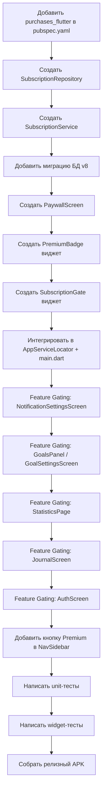

# План внедрения подписки в AxisMind

## 1. Обзор

**Модель монетизации:** 7-дневный бесплатный пробный период → $7/месяц подписка.

**Платформа:** Только Android (iOS пока не планируется).

**Технология:** RevenueCat (`purchases_flutter`).

**Grace period:** 3 дня после неудачного платежа.

После окончания пробного периода пользователь теряет доступ к премиум-функциям, но базовый функционал (медитация, таймер) остаётся бесплатным.

---

## 2. Выбор технологии: RevenueCat

**Рекомендация: [`purchases_flutter`](https://pub.dev/packages/purchases_flutter) (RevenueCat SDK)**

### Почему RevenueCat, а не нативный `in_app_purchase`:

| Критерий | RevenueCat | `in_app_purchase` |
|-----------|------------|-------------------|
| Управление пробным периодом | Встроено в Google Play Console + RevenueCat Dashboard | Только через Google Play Console |
| Кроссплатформенность | Единый API для Android + iOS | Разные API для каждой платформы |
| Восстановление покупок | 1 метод `restorePurchases()` | Ручная реализация |
| Grace period / Retry | Встроено | Нужно реализовывать самому |
| Аналитика | Встроенные дашборды | Нет |
| Тестирование | Sandbox + TestFlight | Play Console testing tracks |

### Альтернатива: `in_app_purchase` (если RevenueCat кажется избыточным)

Если пользователь хочет минимум зависимостей, можно использовать [`in_app_purchase`](https://pub.dev/packages/in_app_purchase) (плагин Flutter). Но тогда:
- Нужно реализовать валидацию подписки на своём backend (или Firebase Functions)
- Нужно реализовать восстановление покупок вручную
- Нет аналитики

**Итог: используем RevenueCat** — это сэкономит недели разработки и даст готовую инфраструктуру.

---

## 3. Матрица функций: Бесплатно vs Премиум

### Бесплатно (всегда доступно):
- ✅ Таймер медитации (5/10/15/20 мин)
- ✅ Базовый дневник сессий (запись заметок, оценка настроения)
- ✅ Базовая статистика (минуты за день/неделю/месяц)
- ✅ Путь к ясности (гид по медитации)
- ✅ Ежедневное напоминание о практике (1 уведомление)
- ✅ Тихие часы

### Премиум ($7/мес после 7 дней пробного периода):
- ⭐ **Мотивационные уведомления** — вдохновляющие цитаты и статистика прогресса
- ⭐ **Напоминания о целях** — вечернее напоминание, если цель дня не выполнена
- ⭐ **Цели медитации** — создание и отслеживание целей (daily/weekly)
- ⭐ **Детальная статистика** — тепловая карта, прогресс уровней, XP
- ⭐ **Синхронизация между устройствами** — Google-аккаунт + Firestore
- ⭐ **Расширенный дневник** — теги, фильтрация, поиск по заметкам

### Обоснование разделения:
- **Мотивация и цели** — ключевые премиум-фичи, которые повышают вовлечённость
- **Синхронизация** — типичная премиум-функция в meditation-приложениях (Headspace, Calm)
- **Детальная статистика** — дополнительная ценность для продвинутых пользователей
- **Базовый таймер и дневник** остаются бесплатными — пользователь видит ценность приложения до подписки

---

## 4. Архитектура

### 4.1 Новые файлы

```
lib/
├── services/
│   └── subscription_service.dart    # Сервис подписки (RevenueCat)
├── screens/
│   ├── paywall_screen.dart          # Экран подписки (paywall)
│   └── subscription_status_screen.dart # Экран статуса подписки
├── data/
│   └── subscription_repository.dart # Локальное кэширование статуса подписки
└── widgets/
    └── premium_badge.dart           # Виджет "Премиум" / бейдж
```

### 4.2 Изменяемые файлы

| Файл | Изменения |
|------|-----------|
| [`pubspec.yaml`](pubspec.yaml) | Добавить зависимость `purchases_flutter: ^7.0.0` |
| [`lib/main.dart`](lib/main.dart) | Инициализация `SubscriptionService` после Firebase |
| [`lib/services/app_service_locator.dart`](lib/services/app_service_locator.dart) | Добавить `SubscriptionService` и `SubscriptionRepository` |
| [`lib/screens/home_screen.dart`](lib/screens/home_screen.dart) | Добавить проверку подписки для премиум-функций |
| [`lib/screens/widgets/nav_sidebar.dart`](lib/screens/widgets/nav_sidebar.dart) | Добавить бейдж "Премиум" / кнопку подписки |
| [`lib/screens/widgets/widescreen_layout.dart`](lib/screens/widgets/widescreen_layout.dart) | Добавить проверку подписки для премиум-функций |
| [`lib/screens/notification_settings_screen.dart`](lib/screens/notification_settings_screen.dart) | Блокировать мотивационные уведомления и напоминания о целях без подписки |
| [`lib/screens/goal_settings_screen.dart`](lib/screens/goal_settings_screen.dart) | Блокировать создание целей без подписки |
| [`lib/screens/statistics_page.dart`](lib/screens/statistics_page.dart) | Блокировать детальную статистику без подписки |
| [`lib/screens/journal_screen.dart`](lib/screens/journal_screen.dart) | Блокировать теги/фильтрацию/поиск без подписки |
| [`lib/screens/auth_screen.dart`](lib/screens/auth_screen.dart) | Блокировать синхронизацию без подписки |

### 4.3 Схема данных (локальное кэширование)

В SQLite таблица `subscription`:

```sql
CREATE TABLE subscription (
    id TEXT PRIMARY KEY DEFAULT 'default',
    is_active INTEGER NOT NULL DEFAULT 0,
    is_trial INTEGER NOT NULL DEFAULT 0,
    expiration_date TEXT,
    product_id TEXT,
    purchased_at TEXT,
    updated_at TEXT NOT NULL
);
```

**Миграция БД v8** в [`database_provider.dart`](lib/data/database_provider.dart).

---

## 5. Компоненты

### 5.1 [`SubscriptionService`](lib/services/subscription_service.dart)

```dart
class SubscriptionService {
  static final SubscriptionService instance = SubscriptionService._();
  
  // RevenueCat Purchases instance
  late final Purchases _purchases;
  
  // Текущий статус подписки
  bool _isActive = false;
  bool _isTrial = false;
  DateTime? _expirationDate;
  
  // Stream статуса подписки для реактивного UI
  final _statusController = StreamController<SubscriptionStatus>.broadcast();
  Stream<SubscriptionStatus> get statusStream => _statusController.stream;
  
  // Инициализация (вызывается в main.dart)
  Future<void> init(String apiKey) async;
  
  // Проверка статуса
  bool get isPremium => _isActive || _isTrial;
  bool get isTrialActive => _isTrial;
  bool get isSubscriptionActive => _isActive;
  
  // Покупка подписки
  Future<bool> purchaseSubscription();
  
  // Восстановление покупок
  Future<bool> restorePurchases();
  
  // Получение цены для отображения в paywall
  Future<String> getSubscriptionPrice();
  
  // Проверка истекших подписок
  Future<void> checkSubscriptionStatus();
}
```

### 5.2 [`PaywallScreen`](lib/screens/paywall_screen.dart)

Экран подписки с:
- Заголовок: "Откройте полный потенциал AxisMind"
- Список премиум-функций (с иконками)
- Крупная кнопка "Попробовать 7 дней бесплатно, затем $7/месяц"
- Текст: "Отмена в любое время"
- Кнопка "Восстановить покупки"
- Кнопка "Продолжить бесплатно" (закрывает экран)
- Ссылка на Privacy Policy и Terms of Use

**Дизайн:** в стиле AxisMind — тёмная тема, золотой акцент, PlayfairDisplay для заголовков.

### 5.3 [`SubscriptionRepository`](lib/data/subscription_repository.dart)

Локальное кэширование статуса подписки в SQLite.
Позволяет приложению работать офлайн и не показывать paywall при каждом запуске.

### 5.4 [`PremiumBadge`](lib/widgets/premium_badge.dart)

Маленький золотой бейдж "PREMIUM" для отображения в UI.
Показывается в NavSidebar и на экране статуса подписки.

---

## 6. Feature Gating (блокировка премиум-функций)

### Паттерн: `SubscriptionGate` widget

```dart
class SubscriptionGate extends StatelessWidget {
  final Widget child;           // Что показать, если есть подписка
  final Widget? lockedChild;    // Что показать вместо (опционально)
  final bool showLockIcon;      // Показывать ли иконку замка
  
  // Если нет подписки — либо показываем lockedChild, либо
  // перенаправляем на PaywallScreen
}
```

### Где применяется:

1. **`NotificationSettingsScreen`** — переключатели "Мотивационные сообщения" и "Напоминания о целях" заблокированы. При попытке включить — показывается paywall или сообщение "Доступно в AxisMind Premium".

2. **`GoalsPanel` / `GoalSettingsScreen`** — кнопка "Добавить цель" ведёт на paywall. Существующие цели продолжают работать (чтобы не злить пользователя).

3. **`StatisticsPage`** — тепловая карта, прогресс уровней, XP заблокированы. Базовая статистика (минуты за день/неделю) остаётся.

4. **`JournalScreen`** — теги, фильтрация, поиск заблокированы. Базовая запись заметок остаётся.

5. **`AuthScreen`** — кнопка "Войти через Google" ведёт на paywall (синхронизация — премиум).

6. **`NavSidebar`** — добавляется кнопка "Премиум" с бейджем, которая ведёт на экран статуса подписки.

---

## 7. Потоки пользователя

### 7.1 Новый пользователь (без подписки)

```
Запуск приложения
  → HomeScreen (базовый функционал)
  → Пытается включить мотивационные уведомления
    → PaywallScreen: "Попробуйте 7 дней бесплатно"
    → Покупает / Закрывает
  → Если купил → 7 дней премиум → $7/мес
  → Если закрыл → продолжает пользоваться бесплатно
```

### 7.2 Пользователь с активной подпиской

```
Запуск приложения
  → SubscriptionService проверяет статус (RevenueCat SDK)
  → Если активна → isPremium = true
  → Все функции доступны
  → NavSidebar показывает "PREMIUM" бейдж
```

### 7.3 Пользователь после окончания пробного периода

```
Запуск приложения
  → SubscriptionService проверяет статус
  → Пробный период истёк, подписка не куплена
  → isPremium = false
  → Премиум-функции заблокированы
  → PaywallScreen показывается при попытке доступа
```

### 7.4 Восстановление покупок

```
Пользователь нажимает "Восстановить покупки"
  → RevenueCat.restorePurchases()
  → Если найдена активная подписка → isPremium = true
  → Если нет → сообщение "Активных покупок не найдено"
```

---

## 8. RevenueCat настройки

### 8.1 Google Play Console

1. Создать продукт подписки: `axismind_premium_monthly`
2. Цена: $7/месяц
3. Пробный период: 7 дней
4. Grace period: 3 дня (чтобы пользователь не потерял доступ сразу при ошибке оплаты)

### 8.2 RevenueCat Dashboard

1. Создать проект AxisMind
2. Подключить Google Play (ввести ключ из Play Console)
3. Подключить App Store (для iOS)
4. Создать entitlement: `premium`
5. Привязать продукт `axismind_premium_monthly` к entitlement `premium`
6. Получить API ключ для Android и iOS

### 8.3 Конфигурация в приложении

API ключи хранятся в [`firebase_options.dart`](lib/firebase_options.dart) или в отдельном конфиге.
Для Android: `googlegson` в AndroidManifest (если требуется RevenueCat).

---

## 9. Тестирование

### 9.1 Unit-тесты

| Файл | Тесты |
|------|-------|
| `test/subscription/subscription_repository_test.dart` | Сохранение/чтение статуса, миграция, офлайн-режим |
| `test/subscription/subscription_service_test.dart` | Моки RevenueCat, проверка статуса, покупка, восстановление |

### 9.2 Widget-тесты

| Файл | Тесты |
|------|-------|
| `test/subscription/paywall_screen_test.dart` | Отображение paywall, кнопки, навигация |
| `test/subscription/subscription_gate_test.dart` | Блокировка контента, отображение lockedChild |

### 9.3 Интеграционные тесты

- Проверка, что премиум-функции недоступны без подписки
- Проверка, что после "покупки" (мок) функции разблокируются

---

## 10. Порядок реализации



### Шаг 1: Зависимости и база
- Добавить `purchases_flutter` в [`pubspec.yaml`](pubspec.yaml)
- Создать [`SubscriptionRepository`](lib/data/subscription_repository.dart)
- Создать [`SubscriptionService`](lib/services/subscription_service.dart)
- Добавить миграцию БД v8 в [`database_provider.dart`](lib/data/database_provider.dart)
- Интегрировать в [`AppServiceLocator`](lib/services/app_service_locator.dart) и [`main.dart`](lib/main.dart)

### Шаг 2: Paywall и UI-компоненты
- Создать [`PaywallScreen`](lib/screens/paywall_screen.dart)
- Создать [`PremiumBadge`](lib/widgets/premium_badge.dart)
- Создать [`SubscriptionGate`](lib/widgets/subscription_gate.dart)

### Шаг 3: Feature Gating (экран за экраном)
- [`NotificationSettingsScreen`](lib/screens/notification_settings_screen.dart) — заблокировать мотивацию и цели
- [`GoalsPanel`](lib/screens/widgets/goals_panel.dart) / [`GoalSettingsScreen`](lib/screens/goal_settings_screen.dart) — заблокировать создание целей
- [`StatisticsPage`](lib/screens/statistics_page.dart) — заблокировать детальную статистику
- [`JournalScreen`](lib/screens/journal_screen.dart) — заблокировать теги/фильтрацию
- [`AuthScreen`](lib/screens/auth_screen.dart) — заблокировать синхронизацию
- [`NavSidebar`](lib/screens/widgets/nav_sidebar.dart) — добавить кнопку Premium

### Шаг 4: Тесты
- Unit-тесты для `SubscriptionRepository`
- Unit-тесты для `SubscriptionService` (с моками RevenueCat)
- Widget-тесты для `PaywallScreen`
- Widget-тесты для `SubscriptionGate`

### Шаг 5: Сборка
- `flutter build apk --release`
- Проверить, что всё компилируется

---

## 11. Риски и компромиссы

| Риск | Решение |
|------|---------|
| RevenueCat SDK увеличивает размер APK | ~2MB, приемлемо |
| Пользователь отключает интернет — как проверить подписку? | Локальное кэширование в SQLite + проверка при каждом запуске |
| Что если RevenueCat сервер недоступен? | Используем последний кэшированный статус + показываем сообщение |
| Пользователь купил подписку на iOS — как восстановить на Android? | RevenueCat restorePurchases() работает кроссплатформенно |
| Grace period — что это? | 3 дня после неудачного платежа, подписка остаётся активной |
| Отмена подписки — как работает? | Пользователь отменяет в Google Play / App Store, подписка действует до конца периода |

---

## 12. Вопросы к пользователю

1. **RevenueCat vs `in_app_purchase`?** — Рекомендую RevenueCat, но если хотите минимум зависимостей — можем использовать нативный плагин.
2. **API ключи RevenueCat** — нужно будет создать аккаунт в RevenueCat и получить API ключи для Android и iOS.
3. **Google Play Console** — нужно создать продукт подписки `axismind_premium_monthly` с ценой $7/мес и 7-дневным пробным периодом.
4. **iOS** — планируется ли публикация в App Store? Если да, нужно будет настроить подписку и там.
5. **Grace period** — добавить 3 дня grace period после неудачного платежа?
